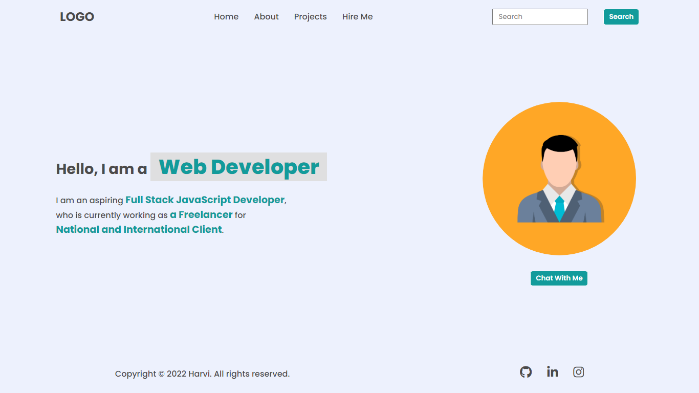
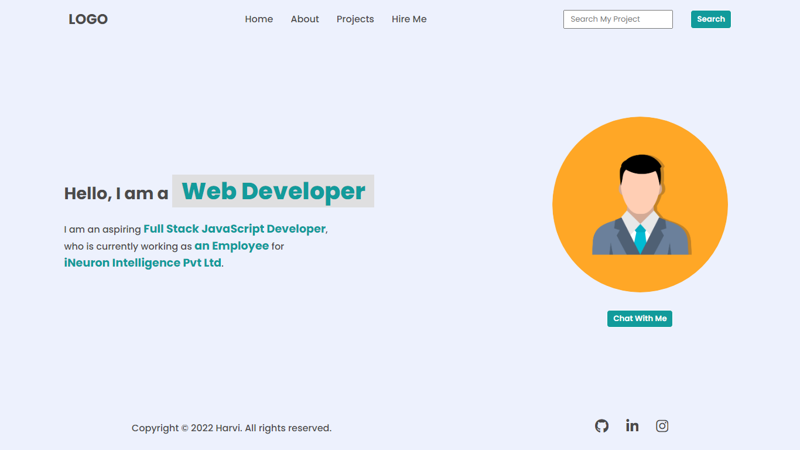
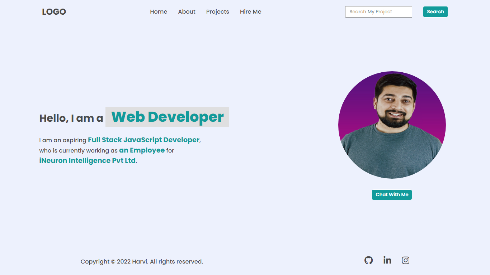
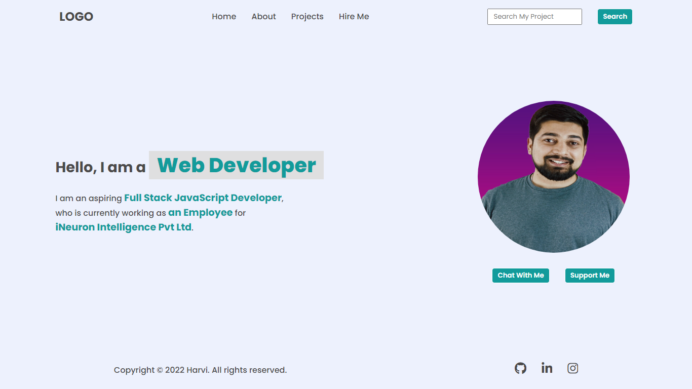

# **DOM Assignment 1**
>**Note**: Tasks for the **Home Page** completed.

---

## **Task 1**
Append two new elements in the navigation menu named **Projects** and **Hire Me** after **About**.

### **After Update**


### **Project Solution**
```js
let allli = document.querySelectorAll("nav ul li")
allli[2].innerText = "Projects"
let ul = document.querySelector("nav ul")
let li = document.createElement("li")
li.innerText = "Hire Me"
ul.appendChild(li)
```
---

## **Task 2**
Change the placeholder of search box from **Search** to **Search My Project**.

### **After Update**


### **Project Solution**
```js
document.querySelector("input").placeholder="Search My Project"
```
---

## **Task 3**
Update the summary description and add the **Github** and **other social media handles** at the footer.

### **After Update**


### **Project Solution**
```js
let allspan = document.querySelectorAll(".hero-left-section p span")
allspan[1].innerText = "an Employee"
allspan[2].innerText = "iNeuron Intelligence Pvt Ltd"

let socialLinks = document.querySelectorAll("footer ul li a")
socialLinks[0].href = "https://github.com/ni5han7"
socialLinks[1].href = "https://www.linkedin.com/in/-nishant/"
socialLinks[2].href = "https://www.instagram.com/ni5han7/"
```
---

## **Task 4**
Change the **Avatar** to **Hitesh Sir's** Profile Image.

### **After update**


### **Project Solution**
```js
document.querySelector(".hero-right-section img").src = "./HITESH-CHOUDHARY-SIR.jpg"
```
---

## **Task 5**
Add a button **Support Me** at the right side of **Chat With Me**.

### **After Update**


### **Project Solution**
```js
let buttons = document.querySelector(".hero-right-section-btns")
let button = document.createElement("button")
buttons.appendChild(button)
button.innerText = "Support Me"
```
---

>DOM Assignment 1 Completed! 